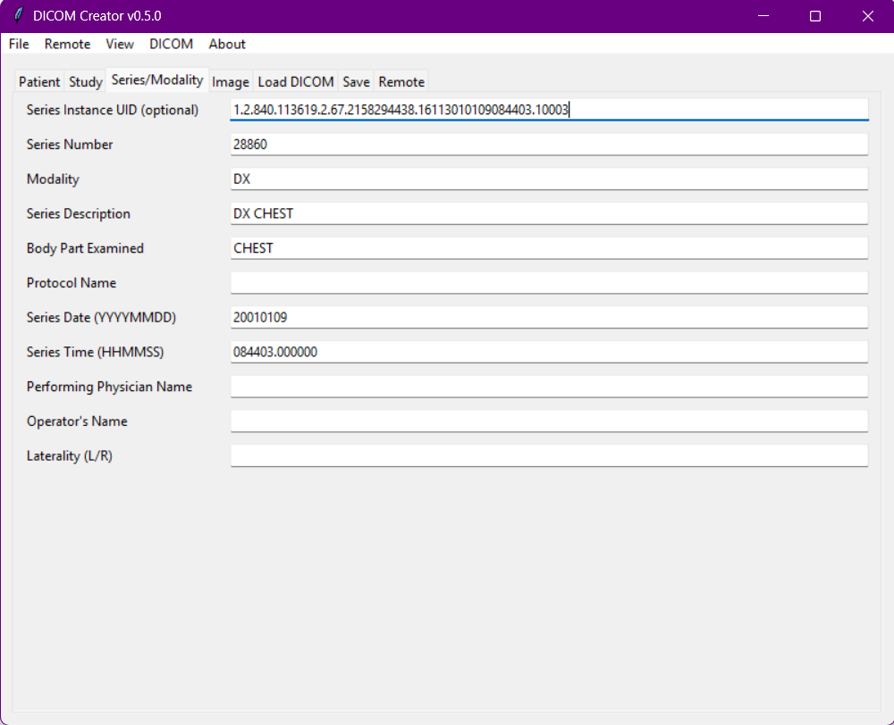
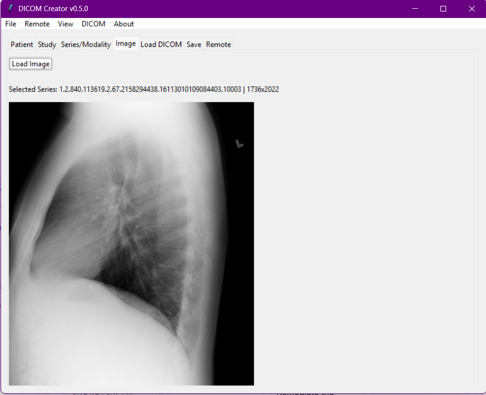
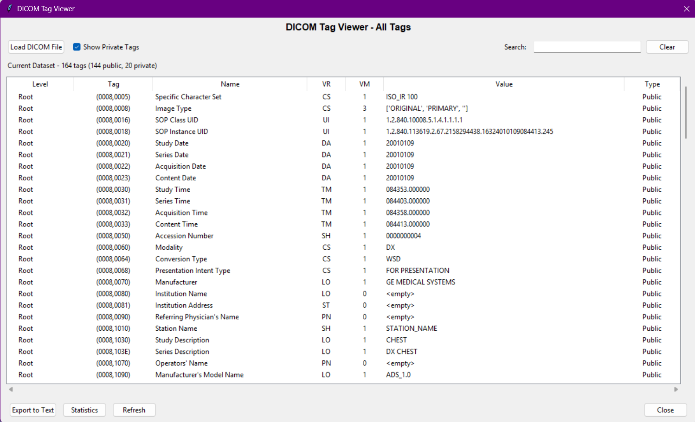
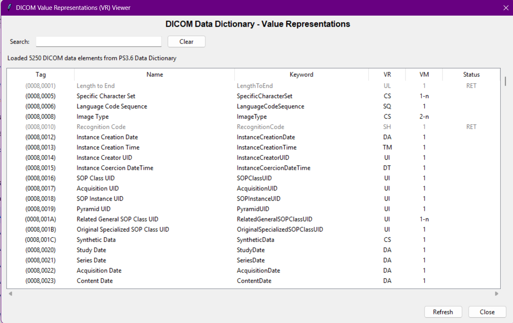

# DICOM Creator

A professional DICOM file creation, editing, and transmission tool with comprehensive testing, validation, and performance analysis capabilities.


## Table of Contents

- [Screenshots](#screenshots)
- [Features](#features)
- [What's New in v0.6.1](#whats-new-in-v061)
- [What's New in v0.6.0](#whats-new-in-v060)
- [Quick Start](#quick-start)
- [Building Your Own EXE](#building-your-own-exe)
- [Usage](#usage)
- [Documentation](#documentation)
- [System Requirements](#system-requirements)
- [Version History](#version-history)
- [Troubleshooting](#troubleshooting)
- [License](#license)

## Screenshots

### Main Application Interface









## What's New in v0.6.1

**Release Date**: February 2026

### 🐛 Bug Fixes

#### LazyImport Class Loading Enhancement
- **Fixed**: ConnectionValidator failed to load correctly when CEchoValidator appeared first in module inspection
- **Enhanced**: LazyImport now intelligently prioritizes main/public classes in modules with multiple class definitions
- **Impact**: Connection Test tab now loads correctly and all LazyImport modules work reliably

#### Improved Error Reporting
- Better error messages when VRValidator or other modules fail to load
- Detailed logging with full stack traces for debugging
- User-friendly error dialogs with diagnostic information

#### Enhanced Documentation
- Added LazyImport usage guidelines to Copilot instructions
- Improved inline documentation in import_helper.py
- Updated docstrings for better code clarity

### ✅ Compatibility
- **100% backward compatible** with v0.6.0
- All settings, presets, and data preserved
- No dependency changes
- Drop-in replacement upgrade

### 📖 Full Details
See [CHANGELOG_v0.6.1.md](doc/CHANGELOG_v0.6.1.md) for complete release notes.

---

## What's New in v0.6.0

**Release Date**: January 2025

### Features

### Core Features
- **DICOM Metadata Management** - Create and edit patient, study, and series metadata
- **Image Support** - Load and preview images (PNG, JPG, BMP) as DICOM pixel data
- **DICOM File Operations** - Load, save, and organize DICOM files and folders
- **Remote Transmission** - Send DICOM files to remote DICOM SCP servers using C-STORE
- **Server Presets** - Save and manage server connection profiles
- **DICOM Tag Viewer** - View all DICOM tags including private tags with search and export
- **VR Validator** - Validate DICOM data against Value Representation specifications

### Advanced Features (v0.3+)

#### **Server Presets**
- Save frequently used DICOM server configurations
- Quick load and apply with one click
- Persistent storage across sessions
- Multi-server profile management

#### **Connection Testing & Validation**
- TCP connection validation to DICOM servers
- Connection quality assessment
- Latency variation analysis
- Real-time network performance metrics

#### **Stress Testing**
- Load simulation and capacity planning
- Configurable test parameters (files/sec, duration, file size)
- Multi-worker support for parallel testing
- Performance metrics collection

#### **Transmission History & Analytics**
- Track all DICOM transmissions with timestamps
- Success/failure statistics and reporting
- Throughput analysis
- JSON export for external reporting

#### **Performance Benchmarking**
- File size performance analysis
- Latency benchmarking
- Throughput measurements
- Performance trend visualization

#### **Parallel Transmission**
- Multi-threaded transmission manager
- 1-10 configurable worker threads
- 3-5x speed improvement over sequential sending
- Real-time progress tracking

#### **Test Data Generation**
- Random DICOM Generator - Create test files with random metadata
- Hierarchical generation (Patient → Study → Series → Instances)
- Bulk generation with configurable sizes
- Integrated testing workflow
- Immediate test and send capabilities

### What's New in v0.6.0

**Enhanced Validation Features:**
- **Real-time VR Validation** - Validate form data as you edit with comprehensive VR compliance checks
- **Validation Dialogs** - Interactive validation reports with field-level error reporting
- **Field-Level Validation** - Immediate feedback on individual DICOM data elements
- **Load-Time Validation** - Automatic validation when loading DICOM files with warnings for issues
- **Pre-Save Validation** - Prevent saving invalid DICOM files with detailed error messages
- **Pre-Send Validation** - Validate before remote transmission to DICOM servers

**UI Improvements:**
- **Validation Report Dialog** - Detailed visual reporting of validation errors and warnings
- **Enhanced Error Messages** - Clear descriptions of validation issues with remediation suggestions
- **Tab Visibility Management** - Toggle test tabs on/off via View menu
- **Improved Image Preview** - Better handling of various image formats and dimensions
- **Enhanced Context Menus** - Right-click on instances to view images

**DICOM Operations:**
- **DICOMDIR Support** - Load and expand DICOMDIR files to reference datasets
- **Private Tag Preservation** - Maintain private tags during save operations
- **Group Length Cleanup** - Automatic removal of deprecated Group Length tags (DICOM 2008+ compliance)
- **Enhanced Tag Verification** - Post-save verification of tag integrity

**Testing Enhancements:**
- **Connection Validator Improvements** - Better error detection and reporting
- **Parallel Transmission** - Improved worker management and progress tracking
- **Transmission History** - Enhanced session tracking and statistics

**Developer & Admin Features:**
- **Improved LazyImport** - Better handling of multi-class modules with explicit class selection
- **Enhanced Logging** - Detailed debug information for troubleshooting
- **Better Error Diagnostics** - Clear error messages for import and module loading issues

**Documentation:**
- Complete VR Validator documentation
- Enhanced troubleshooting guides
- New validation workflow documentation
- Improved API documentation for developers

## Quick Start

### Option 1: Run as EXE (Windows, No Python Required)

[](https://github.com/piotrrozentreter/dcmcreator/releases)

**Download & Extract:**
1. Get the `DICOM Creator` folder from `dist/`
2. Extract anywhere on Windows
3. Double-click `DICOM Creator.exe`

**No installation required!** Everything is packaged inside.

### Option 2: Run from Python Source

**Requirements:**
- Python 3.9 or higher
- Windows, macOS, or Linux

**Installation:**
```bash
# Clone the repository
git clone https://github.com/piotrrozentreter/dcmcreator
cd dcmcreator

# Create virtual environment (optional but recommended)
python -m venv venv
source venv/bin/activate  # On Windows: venv\Scripts\activate

# Install dependencies
pip install -r requirements.txt

# Run the application
python src/app.py
```

**Dependencies:**
- `pydicom` - DICOM file handling
- `pynetdicom` >= 2.0.0 - DICOM network communication
- `pillow` (PIL) - Image processing
- `numpy` - Numerical arrays

## Building Your Own EXE

Want to build a standalone executable yourself?

### Build Requirements

Starting with **v0.4.0+**, the build includes additional optional modules for testing. Make sure you have all dependencies:

```bash
# Install build dependencies (updated for v0.6.0)
pip install -r build-requirements.txt
```

**build-requirements.txt** now includes:
- `PyInstaller>=6.0.0` - EXE builder
- `pillow>=10.0.0` - Image processing
- `pydicom>=2.4.0` - DICOM library (analysis)
- `pynetdicom>=2.0.0` - Network DICOM (analysis)
- `numpy>=1.20.0` - Array processing (analysis)

### Build Process

```bash
# Create icon (generates app.ico)
python create_icon.py

# Build the executable (includes all optional modules)
python build.py
```
For Windows, you can also run:
```bat
build.bat
```

Your standalone EXE will be created in `dist/DICOM Creator/` with:
- All core DICOM features
- All connection testing features
- All stress testing features
- All transmission history features
- All performance benchmarking features
- All parallel transmission features
- Enhanced validation system (v0.6.0)
- Improved LazyImport system (v0.6.0)

**See [doc/BUILD_INSTRUCTIONS.md](doc/BUILD_INSTRUCTIONS.md) for detailed build guide.**

### What's Bundled (v0.6.0)

The build now automatically includes:

| Component | Size | Purpose |
|-----------|------|---------|
| PyDICOM | ~40 MB | DICOM file handling |
| PyNetDICOM | ~30 MB | Network DICOM C-STORE |
| NumPy | ~30 MB | Array processing |
| PIL/Pillow | ~10 MB | Image processing |
| Application | ~5 MB | GUI and logic |
| **Total** | **150-200 MB** | Uncompressed |
| **ZIP** | **60-70 MB** | Compressed distribution |

All optional test modules are automatically included in the build - no extra configuration needed!

## Usage

### Creating DICOM Files

1. Fill in Patient, Study, Series metadata
2. (Optional) Load an image via Image tab
3. Click "Validate" from File menu to check your data (v0.6.0)
4. Click "Save" to save as DICOM

### Loading DICOM Files

1. Go to "Load DICOM" tab
2. Click "Load DICOM File(s)" or "Load DICOM Folder"
3. Select studies/series from the tree
4. Metadata auto-populates in the forms
5. Any validation issues are reported (v0.6.0)

### Sending to Remote Server

1. Fill in Server IP/hostname and Port
2. Optionally adjust AE Titles
3. Validation is performed before sending (v0.6.0)
4. Click "Send All Loaded DICOM"
5. Monitor progress in Messages area

#### Using Server Presets
1. Go to "Remote" tab
2. (Optional) Select a preset from dropdown to auto-load settings
3. Or manually enter server details and click "Save Current" to save as preset
4. Select preset and click "Load" or simply select and it auto-applies
5. Click "Send All Loaded DICOM"

### Data Validation & VR Compliance (v0.6.0)

#### Validate Form Data
- Go to "File" menu → "Validate" to check all form fields against VR specifications
- View detailed validation report with specific error messages
- Get remediation suggestions for invalid values
- Optional: continue anyway if there are only warnings

#### DICOM Data Inspection
- Go to "DICOM" menu → "View VRs" to browse complete DICOM Value Representations
- Go to "DICOM" menu → "View All Tags" to inspect all tags in a DICOM file:
  - View all public and private tags
  - Search and filter tags
  - Export tags to text file
  - View tag statistics
  - Color-coded private tags

#### Automatic Load Validation
- When loading DICOM files, validation is performed automatically
- Any errors or warnings are reported in a dialog
- You can view the full validation report if needed

### Testing & Validation

#### Connection Testing
- Go to "Connection Test" tab
- Enter server details
- Click "Test Connection" to validate
- Review latency and connection quality metrics

#### Stress Testing
- Go to "Stress Test" tab
- Configure test parameters (number of files, duration, worker threads)
- Click "Start Stress Test"
- Monitor real-time performance metrics

#### Transmission History
- Go to "Transmission History" tab
- View all past transmissions
- See success/failure rates
- Export data as JSON

#### Performance Benchmarking
- Go to "Performance Benchmark" tab
- Run benchmarks for file size and latency analysis
- Review throughput trends

#### Parallel Transmission
- Go to "Parallel Transmission" tab
- Configure number of worker threads (1-10)
- Select files and destination
- Transmit with improved performance

### Loading Images
1. Go to Image tab
2. Click "Load Image"
3. Select PNG, JPG, or BMP file
4. Image converts to grayscale and displays preview

## System Requirements

### For EXE (Windows Only)
- Windows 7 or newer (64-bit)
- 100 MB disk space
- 300 MB RAM minimum

### For Python
- Python 3.9+
- Cross-platform: Windows, macOS, Linux
- 500 MB disk space
- 500 MB RAM minimum

## Documentation

### User Documentation
- **[doc/INDEX.md](doc/INDEX.md)** - Complete documentation index and navigation
- **[doc/QUICK_START_TAG_VIEWER.md](doc/QUICK_START_TAG_VIEWER.md)** - Tag Viewer quick start guide
- **[doc/TAG_VIEWER_FEATURE.md](doc/TAG_VIEWER_FEATURE.md)** - Complete Tag Viewer documentation
- **[doc/QUICK_START_PRESETS.md](doc/QUICK_START_PRESETS.md)** - Server Presets quick start guide
- **[doc/SERVER_PRESETS.md](doc/SERVER_PRESETS.md)** - Comprehensive Server Presets documentation
- **[doc/QUICK_START_RANDOM_DICOM.md](doc/QUICK_START_RANDOM_DICOM.md)** - Random DICOM generator quick start
- **[doc/RANDOM_DICOM_GENERATOR.md](doc/RANDOM_DICOM_GENERATOR.md)** - Detailed DICOM generator guide

### Advanced Testing Guides
- **[doc/PARALLEL_TRANSMISSION_GUIDE.md](doc/PARALLEL_TRANSMISSION_GUIDE.md)** - Parallel transmission setup and tuning
- **[doc/QUICK_TEST_EXECUTION_GUIDE.md](doc/QUICK_TEST_EXECUTION_GUIDE.md)** - Testing workflow guide
- **[doc/COMPLETE_TEST_EXECUTION_REFERENCE.md](doc/COMPLETE_TEST_EXECUTION_REFERENCE.md)** - Complete testing reference
- **[doc/HIERARCHICAL_GENERATION.md](doc/HIERARCHICAL_GENERATION.md)** - Hierarchical DICOM generation guide
- **[test/README.md](test/README.md)** - Test scripts documentation

### Running Tests
```bash
# Run all tests
python test/run_all_tests.py

# Run individual tests
python test/test_hierarchical_generation.py
python test/test_build.py
python test/verify_build.py
```

### Developer Documentation
- **[doc/DEVELOPER_GUIDE_PRESETS.md](doc/DEVELOPER_GUIDE_PRESETS.md)** - Developer guide for Server Presets
- **[doc/EXTERNAL_SCRIPT_USAGE.md](doc/EXTERNAL_SCRIPT_USAGE.md)** - Using DICOM Creator as a library

### Build & Deployment
- **[doc/BUILD_INSTRUCTIONS.md](doc/BUILD_INSTRUCTIONS.md)** - Complete guide to building the EXE
- **[doc/DISTRIBUTION_GUIDE.md](doc/DISTRIBUTION_GUIDE.md)** - Distribution and deployment guide

### Additional Resources
- **[examples/](examples/)** - Example scripts for common tasks
- **[doc/CHANGELOG_v0.6.1.md](doc/CHANGELOG_v0.6.1.md)** - Release notes for v0.6.1 (Latest)
- **[doc/CHANGELOG_v0.6.0.md](doc/CHANGELOG_v0.6.0.md)** - Release notes for v0.6.0
- **[doc/CHANGELOG_v0.5.0.md](doc/CHANGELOG_v0.5.0.md)** - Release notes for v0.5.0
- **[doc/CHANGELOG_v0.4.0.md](doc/CHANGELOG_v0.4.0.md)** - Release notes for v0.4.0
- **[doc/CHANGELOG_v0.3.0.md](doc/CHANGELOG_v0.3.0.md)** - Release notes for v0.3.0+

## Project Structure

```
dcmcreator/
├── src/
│   ├── app.py                      (Entry point)
│   ├── appgui.py                   (Main GUI application - v0.6.1)
│   ├── app_logic.py                (Core application logic)
│   ├── import_helper.py            (Enhanced LazyImport - v0.6.1)
│   ├── dcm.py                      (DICOM creation/loading)
│   ├── remote.py                   (DICOM C-STORE sending)
│   ├── presets.py                  (Server Presets management)
│   ├── connection_validator.py     (Connection testing - v0.6.1 fix)
│   ├── stress_tester.py            (Stress testing)
│   ├── transmission_history.py     (Transmission tracking)
│   ├── performance_benchmarking.py (Performance analysis)
│   ├── parallel_transmission.py    (Multi-threaded sending)
│   ├── random_dicom.py             (Test DICOM generator)
│   ├── test_runner.py              (Testing framework)
│   ├── vr_validator.py             (VR validation - v0.6.0)
│   ├── validation_dialog.py        (Validation UI - v0.6.0)
│   ├── tag_dialog.py               (Tag viewer UI)
│   └── dcmlogger.py                (Logging setup)
├── test/                           (Test scripts and verification)
│   ├── test_build.py               (Build system test)
│   ├── test_hierarchical_generation.py (Hierarchical DICOM test)
│   ├── test_tag_viewer.py          (Tag viewer test)
│   ├── verify_build.py             (Build verification)
│   ├── run_all_tests.py            (Run all tests)
│   └── README.md                   (Test documentation)
├── examples/                       (Example scripts for features)
├── doc/                            (Comprehensive documentation)
├── dist/                           (Distribution EXE folder)
├── build.py                        (Python build script)
├── build.bat                       (Windows build script)
├── dcmcreator.spec                 (PyInstaller configuration)
├── create_icon.py                  (Icon generator)
├── requirements.txt                (Runtime dependencies)
├── build-requirements.txt          (Build dependencies)
├── .github/copilot-instructions.md (Development guidelines)
├── pic1.png                        (Screenshot - Main interface)
├── pic2.png                        (Screenshot - DICOM tree/remote)
├── pic3.png                        (Screenshot - Test generation)
├── pic4.png                        (Screenshot - Connection testing)
└── README.md                       (This file)
```

## Version History

### Version 0.6.1 (Current)
**Release Date**: February 2026

**Bug Fixes:**
- **LazyImport Class Loading** - Fixed ConnectionValidator loading when multiple classes exist in module
- **Enhanced Error Reporting** - Better error messages for module loading failures
- **Improved Logging** - Detailed class loading attempts with full context

**Improvements:**
- Intelligent class selection for modules with multiple classes
- Enhanced documentation and Copilot instructions
- Better fallback mechanisms for missing dependencies

**Compatibility:**
- 100% backward compatible with v0.6.0
- All settings and data preserved
- No dependency changes

**Full Details:** See [CHANGELOG_v0.6.1.md](doc/CHANGELOG_v0.6.1.md)

---

### Version 0.6.0
**Release Date**: January 2025

**Major Features:**
- **Real-time VR Validation System** - Comprehensive validation of DICOM data elements
- **Validation Report Dialogs** - Interactive UI for viewing and understanding validation issues
- **DICOM Load Validation** - Automatic validation when loading DICOM files with error reporting
- **Pre-Send Validation** - Validate before remote transmission to ensure compliance
- **DICOMDIR Support** - Load and reference DICOM dataset files
- **Private Tag Preservation** - Maintain private tags during file operations
- **Group Length Cleanup** - Automatic DICOM 2008+ compliance

**Enhancements:**
- Enhanced field-level validation with remediation suggestions
- Improved context menus for DICOM instances
- Better image preview handling for various formats
- Improved error messages and diagnostics

**UI Improvements:**
- View menu for toggling test tabs on/off
- Enhanced validation dialogs with detailed reporting
- Better image preview resizing and display
- Improved right-click context menus

**Bug Fixes:**
- Fixed validation dialog display issues
- Improved error handling for missing dependencies
- Better handling of edge cases in image preview

**Full Details:** See [CHANGELOG_v0.6.0.md](doc/CHANGELOG_v0.6.0.md)

---

### Version 0.5.0
**Release Date**: January 2025

**New Features:**
- Enhanced LazyImport system with improved class detection
- Better handling of modules with multiple classes
- Improved module loading reliability

**Improvements:**
- Better error diagnostics for module loading
- Enhanced logging for troubleshooting
- Performance optimizations

**Bug Fixes:**
- Fixed ConnectionValidator class loading issue
- Improved module import reliability
- Better handling of missing optional dependencies

### Version 0.4.0
**Release Date**: December 2024

**Major Features:**
- Connection testing and validation
- Stress testing capabilities
- Transmission history tracking
- Performance benchmarking
- Parallel transmission manager

### Version 0.3.0
**Release Date**: November 2024

**Major Features:**
- Server Presets management
- Tag Viewer with search and export
- VR Validator
- Random DICOM Generator

### Version 0.2.0
**Release Date**: October 2024

**Major Features:**
- Remote DICOM transmission (C-STORE)
- DICOM file loading and organization
- Image loading and preview

### Version 0.1.0
**Release Date**: September 2024

**Initial Release:**
- Basic DICOM creation
- Patient/Study/Series metadata management
- Save DICOM files

## Author

Written by **Piotr Rozentreter**

## License

MIT License. See `LICENSE` for details.

## Support & Contributing

- **GitHub**: https://github.com/piotrrozentreter/dcmcreator
- **Issues**: Report bugs via GitHub Issues
- **Internal Support**: Contact development team

## Troubleshooting

### EXE Won't Start
- Windows may block unsigned executables - click "More info" -> "Run anyway"
- Check antivirus software settings
- Run from command line for error messages: `"DICOM Creator.exe"`

### Slow Startup
- First run takes 15-30 seconds (unpacking files)
- Subsequent runs are faster (5-10 seconds)
- Normal behavior for PyInstaller executables

### Dependencies Missing
- Ensure Python 3.9+ is installed
- Run `pip install -r requirements.txt` to install dependencies
- Check that pydicom and pynetdicom are properly installed

### Connection Issues
- Use "Connection Test" tab to validate server connectivity
- Check firewall and network settings
- Verify server IP and port are correct
- Try saving and loading a Server Preset

### Module Loading Issues (v0.5.0+)
- Check log files for detailed error messages
- Verify all dependencies are installed
- Try reinstalling with `pip install -r requirements.txt --force-reinstall`
- Contact support if LazyImport errors persist

### Validation Issues (v0.6.0)
- Check that `src/VR.xml` exists in your installation
- VR Validator requires the complete DICOM dictionary
- Review validation error messages for specific remediation steps
- Fields marked with warnings can still be saved if needed

### Common Error Messages

#### "VRValidator not available"
- VR.xml file missing from installation
- Check that `src/VR.xml` exists
- Rebuild or reinstall the application

#### "Connection Validator could not be loaded"
- Fixed in v0.5.0 with enhanced LazyImport
- Update to latest version
- Check that `connection_validator.py` is present

#### "Validation errors found"
- Review the validation report dialog (v0.6.0)
- Common issues: incorrect date format (YYYYMMDD), invalid VR values
- Fix issues or click "Continue" if warnings only
